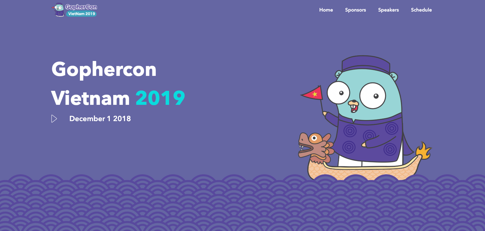

# GopherCon Landing Page

This is the official repo for Gopher Conference website.

It was built using [react-static](https://github.com/nozzle/react-static), a progressive static-site generator for React. The output is a static website hosted in Netlify.

## How to Contribute

Want to help? Sweet! We like help. Pull requests are very welcome. Here's how
to get started:

1. Fork the repository
2. Make some changes (see _Build Instructions_ below)
3. Push your changes to your fork
4. Open a pull request

When you open a pull request, we'd appreciate if you follow some basic
guidelines:

- Describe what you're changing, and more importantly _why_ you're changing it
- Keep the pull request focused on one thing - if you make two different,
  unrelated changes, please separate them into two pull requests
- Some pull requests won't get merged. All changes are reviewed by a committee
  member, and sometimes changes don't fit with the organisation's vision.

## Build Instructions

Building and deploying the site is done via `yarn`

- `yarn` installs dependencies
- `yarn dev` runs webpack dev server for development mode
- `yarn build` builds source code to static files for production
- `yarn serve` serves compiled static files on local

## License

 Gopher Con website by <a xmlns:cc="http://creativecommons.org/ns#" href="#" property="cc:attributionName" rel="cc:attributionURL">Gopher Con</a> is licensed under a <a rel="license" href="http://creativecommons.org/licenses/by-nc/3.0/">Creative Commons Attribution-NonCommercial 3.0 Unported License</a>. 
